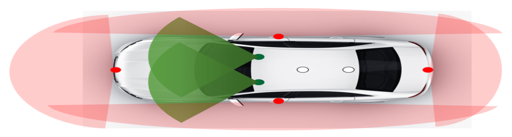

# Paper Reading | Towards Autonomous Parking using Vision-only Sensors (2021)

> Y. Yang et al., "[Towards Autonomous Parking using Vision-only Sensors](https://ieeexplore.ieee.org/document/9636106)," 2021 IEEE/RSJ International Conference on Intelligent Robots and Systems (IROS), Prague, Czech Republic, 2021, pp. 2038-2044, doi: 10.1109/IROS51168.2021.9636106.
>
> 作者： [Yi Yang](https://ieeexplore.ieee.org/author/37899921700) , [https://ieeexplore.ieee.org/author/3789992170](https://ieeexplore.ieee.org/author/37899921700)
>
> 北京理工大学：[https://bit.edu.cn/](https://bit.edu.cn/)

## 0. 摘要

* 本文提出了一种**仅通过视觉传感器**实现了自主停车的方法；
* 通过适当的**深度估计算法**实现了对停车环境的精确感知（包括像素级深度估计和构建稠密点云）；
* 通过**改进的Radon变换方法**实现了更好的停车位检测效果；
* 效果：在中等计算平台上实现了5Hz以上的处理速度。

## 1. 简介

* 现有的自动泊车系统方案大多依赖**特殊标志**\[1]、**预先构建的地图**\[2]或**精确的测距传感器**\[3]\[4]来实现对停车环境的感知，而本方案在没有先验地图的条件下只依靠视觉传感器实现；
* 本研究按以下步骤实现这一功能：
  1. 获得图像的尺度信息。通过车身的四个鱼眼相机，并采用**基于机器学习的单目深度预测算法**获得像素级的图像深度信息，可以达到类似LiDAR的感知效果；
  2. 优化方案的实时性。对生成的点云地图进行采样。
  3. 获得更好的停车位检测效果。对鱼眼相机采集的图像进行**去畸变**和**逆透视**，变换为二维地平面，再使用**基于Radon变换**的方法检测停车位。
  4. 提出一种自主停车框架用来描述泊车任务，可分为三部分：度量空间、语义空间和行为空间。          度量空间包括环境的几何信息、车辆和相机的位姿描述；                                                                 语义空间包括提取的高级环境信息；                                                                                                  行为空间包括车辆的规划和控制信息。                                              &#x20;
* <mark style="color:red;">**本文贡献**</mark>：
  * 将基于深度学习的单目深度预测方法应用到低成本鱼眼相机中，实现了类似于LiDAR的测距和传感效果。
  * 提出了一种基于Radon变换的停车位检测方法，更好地从鱼眼摄像机中检测停车位。

## 2. 相关研究

* 特殊标志：[\[1\]](paper-reading-or-towards-autonomous-parking-using-vision-only-sensors-2021-iros.md#r.-can-kao-wen-xian) 通过基准标签实现定位，包括二维码和停车位ID。
* 预建地图：[\[2\]](paper-reading-or-towards-autonomous-parking-using-vision-only-sensors-2021-iros.md#r.-can-kao-wen-xian) 使用主动学习来检测停车位，从而预先构建停车位的语义图，用于定位。
* 高精度激光雷达：                                                                                                                                     [\[3\]](paper-reading-or-towards-autonomous-parking-using-vision-only-sensors-2021-iros.md#r.-can-kao-wen-xian) 通过从LiDAR点云中提取感兴趣区域来完成检测和定位的任务。                                                    [\[4\]](paper-reading-or-towards-autonomous-parking-using-vision-only-sensors-2021-iros.md#r.-can-kao-wen-xian) 利用LiDAR检测周围障碍物，提出了一种基于车辆通信的协同导航方法

### 2.1 自动停车系统的两个关键方面：

#### 2.1.1 识别环境中的可通行区域 ：

主流的可通行区域检测方法可分为**基于激光雷达**的方法和**基于图像**的方法。

激光雷达:

* [\[5\]](paper-reading-or-towards-autonomous-parking-using-vision-only-sensors-2021-iros.md#r.-can-kao-wen-xian), [\[6\]](paper-reading-or-towards-autonomous-parking-using-vision-only-sensors-2021-iros.md#r.-can-kao-wen-xian) 利用激光雷达传感器划分障碍物，通过建立网格地图分析场景中物体的三维高度，进而划分可通行区域。

图像：

* 基于图像的方法主要通过图像中场景的特征（例如颜色[\[7\]](paper-reading-or-towards-autonomous-parking-using-vision-only-sensors-2021-iros.md#r.-can-kao-wen-xian)、纹理[\[8\]](paper-reading-or-towards-autonomous-parking-using-vision-only-sensors-2021-iros.md#r.-can-kao-wen-xian) 和视觉消失点[\[9\]](paper-reading-or-towards-autonomous-parking-using-vision-only-sensors-2021-iros.md#r.-can-kao-wen-xian)）来划分可遍历区域，这些基于特征的算法对阴影和灯光变化等噪声具有鲁棒性。
* 基于深度学习的图像深度估计方法：Monodepth2[\[10\]](paper-reading-or-towards-autonomous-parking-using-vision-only-sensors-2021-iros.md#r.-can-kao-wen-xian) 通过自监督学习达到了与监督学习相同的深度估计效果，使得深度估计算法摆脱了测距数据的限制；[\[11\]](paper-reading-or-towards-autonomous-parking-using-vision-only-sensors-2021-iros.md#r.-can-kao-wen-xian) 提出了一种基于四个鱼眼相机特征点匹配的深度估计算法，但该算法要求鱼眼相机有足够的重叠视场进行特征匹配。

#### 2.1.2 停车位检测：

最常用的方法是检测停车线的特征，并根据停车位的几何结构进行识别。

* [\[12\]](paper-reading-or-towards-autonomous-parking-using-vision-only-sensors-2021-iros.md#r.-can-kao-wen-xian)、[\[13\]](paper-reading-or-towards-autonomous-parking-using-vision-only-sensors-2021-iros.md#r.-can-kao-wen-xian) 分别通过Hough变换和Radon变换提取停车位线。
* [\[14\]](paper-reading-or-towards-autonomous-parking-using-vision-only-sensors-2021-iros.md#r.-can-kao-wen-xian) 使用 Canny 边缘和 Radon 变换对停车位线进行建模。
* [\[15\]](paper-reading-or-towards-autonomous-parking-using-vision-only-sensors-2021-iros.md#r.-can-kao-wen-xian) 利用索贝尔滤波器和随机样本一致性（RANSAC）来检测停车位线。

利用深度传感器测量的深度信息来检测可以停车的空闲空间也是识别停车位的一种方法。

* [\[16\]](paper-reading-or-towards-autonomous-parking-using-vision-only-sensors-2021-iros.md#r.-can-kao-wen-xian) 中使用短程毫米波雷达构建用于停车位检测的网格地图。
* [\[17\]](paper-reading-or-towards-autonomous-parking-using-vision-only-sensors-2021-iros.md#r.-can-kao-wen-xian) 使用超声波传感器来评估停车位的占用状态。

基于机器学习的方法也应用于停车位检测。

* [\[18\]](paper-reading-or-towards-autonomous-parking-using-vision-only-sensors-2021-iros.md#r.-can-kao-wen-xian) 在分隔线检测中使用线聚类方法，并使用基于多视图融合的学习方法来生成候选停车位。
* [\[19\]](paper-reading-or-towards-autonomous-parking-using-vision-only-sensors-2021-iros.md#r.-can-kao-wen-xian) 使用卷积神经网络来检测街上可用的停车位，并通过滚动空间间隔来识别候选停车位。
* [\[20\]](paper-reading-or-towards-autonomous-parking-using-vision-only-sensors-2021-iros.md#r.-can-kao-wen-xian) 用于语义分割的全卷积网络用于直接识别自由空间、槽标记、车辆和其他对象。

## 3.  自动停车系统

### 3.1 驾驶空间框架

一共有六个相机，作用不同，处理的方法也不同：

* 前视双目相机（<mark style="color:red;">度量空间</mark>）：应用 [ORB-SLAM3](https://arxiv.org/abs/2007.11898)，来确定车辆的姿态；应用改进的半全局匹配（SGM）[\[22\]](paper-reading-or-towards-autonomous-parking-using-vision-only-sensors-2021-iros.md#r.-can-kao-wen-xian)和 MonoDepth2 [\[10\]](paper-reading-or-towards-autonomous-parking-using-vision-only-sensors-2021-iros.md#r.-can-kao-wen-xian)，来进行双目深度估计。
* 四个鱼眼相机（<mark style="color:red;">度量空间</mark>）：应用改进的半全局匹配（SGM）[\[22\]](paper-reading-or-towards-autonomous-parking-using-vision-only-sensors-2021-iros.md#r.-can-kao-wen-xian)和 MonoDepth2 [\[10\]](paper-reading-or-towards-autonomous-parking-using-vision-only-sensors-2021-iros.md#r.-can-kao-wen-xian)，来进行单目深度估计。

深度估计的结果在构造八叉树图或地平面分割后，构建的度量空间中的三维点云图用于生成用于路径规划的**可遍历图**。

* 从鱼眼相机获得的图像，经过去畸变和反向透视变化，再经过本文提出的**基于 Radon 变换**的停车位检测方法、**线滤波器和角滤波器模块**，提取出**停车位**（<mark style="color:red;">语义空间</mark>）。
* 获得用于路径规划的**可遍历图**后，使用**基于几何的路径规划方法**来生成适当的路径，避免停车过程中的碰撞（<mark style="color:red;">行为空间</mark>）。

### 3.2 平台概览

下面介绍相机安装位置：

从图1可知，一共有6个相机。其中2个构成基线为60 cm的前向双目系统，另外4个170视场的鱼眼摄像头分布在车身周围，使得系统可获取距车身0.1m以内的地面信息。

<figure><figcaption>
图1. 车辆上安装的传感器
</figcaption></figure>

### 3.3 定位

主要使用的方法基于[ORB-SLAM3](https://arxiv.org/abs/2007.11898) [\[21\]](paper-reading-or-towards-autonomous-parking-using-vision-only-sensors-2021-iros.md#r.-can-kao-wen-xian) 而开发的，定位流程如图2所示：

<figure><figcaption>
图2. 在线定位的流程
</figcaption></figure>

从图2不难发现，图片同步输入后进行预处理，然后提取ORB特征，进行车辆位姿预测，再进行“三板斧”——跟踪，局部建图，回环检测。

### 3.4 泊车环境测绘

该节主要讲述构建可遍历地图的过程。

1. 首先需要从鱼眼相机采集的图像中获取距离信息，以代替激光雷达的作用。主流方法大多是**基于深度学习算法**，本文使用了**Monodepth2**[\[10\]](paper-reading-or-towards-autonomous-parking-using-vision-only-sensors-2021-iros.md#r.-can-kao-wen-xian) 方法，它只需要连续的视频序列进行训练，不需要其他测距传感器进行标记。
2. 获得图像的像素深度后，我们将像素投影到三维度量空间中构建**点云图**，并进一步将其转换为**八叉树图**，最后将其投影到地面形成**可遍历的地图**。
3. 为了优化实时运行速度，对于双目相机，采用改进的半全局匹配方法获得密集视差图，对于图像中的每个像素，其特征向量通过 Center‑symmetric census transform（**CSCT**）计算\[23]。 通过特征向量的 Hamming distance（**汉明距离**）来衡量两个像素之间的相似度，找到每个像素相似度最大的匹配点，经过代价聚合和视差细化过滤后得到**稠密视差图**。
4. 使用**基于stixel**的自由空间分割方法，计算每个像素处的地面视差理论值，结合实际计算得到的稠密视差图，通过**动态规划算法**分割图像的地平面部分。

尽管该算法在大多数情况下表现良好，但由于密集视差图生成的结果不佳，它仍然会出现错误。因此，在生成地图时，仅将相邻帧中连续被确定为可穿越区域的部分添加到地图中。

### 3.5 感知

该节主要讲述语义空间的构成，提出了一种带有停车线标记的停车位识别方法

1.

## R. 参考文献

* [ ] \[1] Y. Huang, J. Zhao, X. He, S. Zhang and T. Feng, "[Vision-based Semantic Mapping and Localization for Autonomous Indoor Parking](https://ieeexplore.ieee.org/document/8500516)," 2018 IEEE Intelligent Vehicles Symposium (IV), Changshu, China, 2018, pp. 636-641, doi: 10.1109/IVS.2018.8500516.
* [ ] \[2] H. Grimmett et al., "[Integrating metric and semantic maps for vision-only automated parking](https://ieeexplore.ieee.org/abstract/document/7139484)," 2015 IEEE International Conference on Robotics and Automation (ICRA), Seattle, WA, USA, 2015, pp. 2159-2166, doi: 10.1109/ICRA.2015.7139484.
* [ ] \[3] Lee, B., Wei, Y., and Guo, I. Y.: [AUTOMATIC PARKING OF SELF-DRIVING CAR BASED ON LIDAR](https://isprs-archives.copernicus.org/articles/XLII-2-W7/241/2017/isprs-archives-XLII-2-W7-241-2017.pdf), Int. Arch. Photogramm. Remote Sens. Spatial Inf. Sci., XLII-2/W7, 241–246, https://doi.org/10.5194/isprs-archives-XLII-2-W7-241-2017, 2017.
* [ ] \[4] B. Li, L. Yang, J. Xiao, R. Valde, M. Wrenn and J. Leflar, "[Collaborative Mapping and Autonomous Parking for Multi-Story Parking Garage](https://ieeexplore.ieee.org/document/8307497)," in IEEE Transactions on Intelligent Transportation Systems, vol. 19, no. 5, pp. 1629-1639, May 2018, doi: 10.1109/TITS.2018.2791430.
* [ ] \[5] S. Kammel and B. Pitzer, "[Lidar-based lane marker detection and mapping](https://ieeexplore.ieee.org/document/4621318)," 2008 IEEE Intelligent Vehicles Symposium, Eindhoven, Netherlands, 2008, pp. 1137-1142, doi: 10.1109/IVS.2008.4621318.
* [ ] \[6] G. Zhao and J. Yuan, "[Curb detection and tracking using 3D-LIDAR scanner](https://ieeexplore.ieee.org/abstract/document/6466890)," 2012 19th IEEE International Conference on Image Processing, Orlando, FL, USA, 2012, pp. 437-440, doi: 10.1109/ICIP.2012.6466890.
* [ ] \[7] Broggi, A. and Berte, S., “[Vision-Based Road Detection in Automotive Systems: A Real-Time Expectation-Driven Approach](https://arxiv.org/abs/cs/9512102)”, _arXiv e-prints_, 1995. doi:10.48550/arXiv.cs/9512102.
* [ ] \[8] Yinghua He, H. Wang and Bo Zhang, "[Color-based road detection in urban traffic scenes](https://ieeexplore.ieee.org/document/1364007)," in IEEE Transactions on Intelligent Transportation Systems, vol. 5, no. 4, pp. 309-318, Dec. 2004, doi: 10.1109/TITS.2004.838221.
* [ ] \[9] C. Rasmussen, "[Grouping dominant orientations for ill-structured road following](https://ieeexplore.ieee.org/document/1315069)," Proceedings of the 2004 IEEE Computer Society Conference on Computer Vision and Pattern Recognition, 2004. CVPR 2004., Washington, DC, USA, 2004, pp. I-I, doi: 10.1109/CVPR.2004.1315069.
* [ ] \[10] Godard, C., Mac Aodha, O., Firman, M., and Brostow, G., “[Digging Into Self-Supervised Monocular Depth Estimation](https://arxiv.org/abs/1806.01260)”, _arXiv e-prints_, 2018. doi:10.48550/arXiv.1806.01260.
* [ ] \[11] C. Won, J. Ryu and J. Lim, "[End-to-End Learning for Omnidirectional Stereo Matching With Uncertainty Prior](https://ieeexplore.ieee.org/document/9086445)," in IEEE Transactions on Pattern Analysis and Machine Intelligence, vol. 43, no. 11, pp. 3850-3862, 1 Nov. 2021, doi: 10.1109/TPAMI.2020.2992497.
* [ ] \[12] Ho Gi Jung, Dong Suk Kim, Pal Joo Yoon and Jaihie Kim, "[Parking Slot Markings Recognition for Automatic Parking Assist System](https://ieeexplore.ieee.org/document/1689613)," 2006 IEEE Intelligent Vehicles Symposium, Meguro-Ku, Japan, 2006, pp. 106-113, doi: 10.1109/IVS.2006.1689613.
* [ ] \[13] S. Lee and S.-W. Seo, “[Available parking slot recognition based on slot context analysis](https://ietresearch.onlinelibrary.wiley.com/doi/full/10.1049/iet-its.2015.0226),” Iet Intelligent Transport Systems.
* [ ] \[14] C. Wang, H. Zhang, M. YANG, X. Wang, L. Ye, and C. Guo, “[Automatic parking based on a bird’s eye view vision system](https://journals.sagepub.com/doi/full/10.1155/2014/847406),” Advances in Mechanical Engineering, vol. 6, pp. 847406–847406, 08 2015.
* [ ] \[15] J. K. Suhr, Member, IEEE, S. Member, and IEEE, “[Automatic Parking Space Detection and Tracking for Underground and Indoor Environments](https://ieeexplore.ieee.org/document/7460227),” IEEE Transactions on Industrial Electronics, vol. 63, no. 9, pp. 5687–5698, 2016.
* [ ] \[16] M. R. Schmid, S. Ates, J. Dickmann, F. V. Hundelshausen, and H. J. Wuensche, “[Parking space detection with hierarchical dynamic occupancy grids](https://ieeexplore.ieee.org/document/5940476),”
* [ ] \[17] A. Kianpisheh, N. Mustaffa, P. Limtrairut, and et al., “[Smart parking system (sps) architecture using ultrasonic detector](https://www.researchgate.net/publication/230701092\_Smart\_Parking\_System\_SPS\_Architecture\_Using\_Ultrasonic\_Detector),” International Journal of Software Engineering and Its Applications, vol. 6, no. 3, p. 518, 2012.
* [ ] \[18] Q. Li and Y. Zhao, “[Geometric features-based parking slot detection](https://www.ncbi.nlm.nih.gov/pmc/articles/PMC6163349/),” Sensors, vol. 18, p. 2821, 08 2018.
* [ ] \[19] K. Gkolias and E. I. Vlahogianni, “[Convolutional neural networks for on-street parking space detection in urban networks](https://ieeexplore.ieee.org/document/8577026),” IEEE Transac- tions on Intelligent Transportation Systems, pp. 1–10.
* [ ] \[20] C. Jang and M. Sunwoo, “[Semantic segmentation-based parking space detection with standalone around view monitoring system](https://link.springer.com/article/10.1007/s00138-018-0986-z),” Machine Vision and Applications, 2019.
* [ ] \[21]&#x20;
* [ ] \[22]&#x20;
* [ ] \[23]&#x20;
* [ ] \[24]&#x20;
* [ ] \[25]&#x20;

